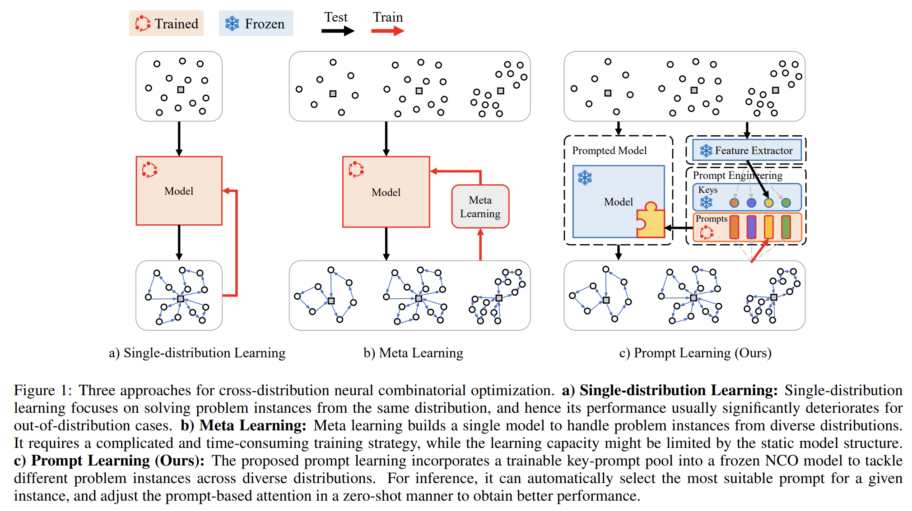

# PromptVRP
This is the source code for paper [Prompt Learning for Generalized Vehicle Routing](https://www.ijcai.org/proceedings/2024/0771.pdf)

The PromptVRP method introduces prompt learning to enable rapid zero-shot adaptation of a pre-trained model for solving routing problems across various distributions. By learning prompts from different distributions and selecting the most suitable one for each problem instance, this model enhances the efficiency of pre-trained attention models.

This pioneering approach represents the first application of prompt learning to routing problems. We anticipate that as the capabilities of pre-trained and foundation models continue to grow, prompt learning shows great promise for addressing routing and other combinatorial optimization challenges in the future.





### Files

+ Train: files for training
+ Test: files for testing
+ Pretrained: pretrained promptVRP model used in the paper
+ Instances: instances for testing
+ utils: util files

### Train

```
cd Train
python train.py
```

### Test

```
cd Test
python test.py
python test_cvrplib.py
```


If you find the code helpful, please cite our paper

```
@article{liu2024prompt,
  title={Prompt Learning for Generalized Vehicle Routing},
  author={Fei Liu, Xi Lin, Weiduo Liao, Zhenkun Wang, Qingfu Zhang, Xialiang Tong and Mingxuan Yuan},
  journal={International Joint Conferences on Artificial Intelligence (IJCAI)},
  year={2024}
}
```

